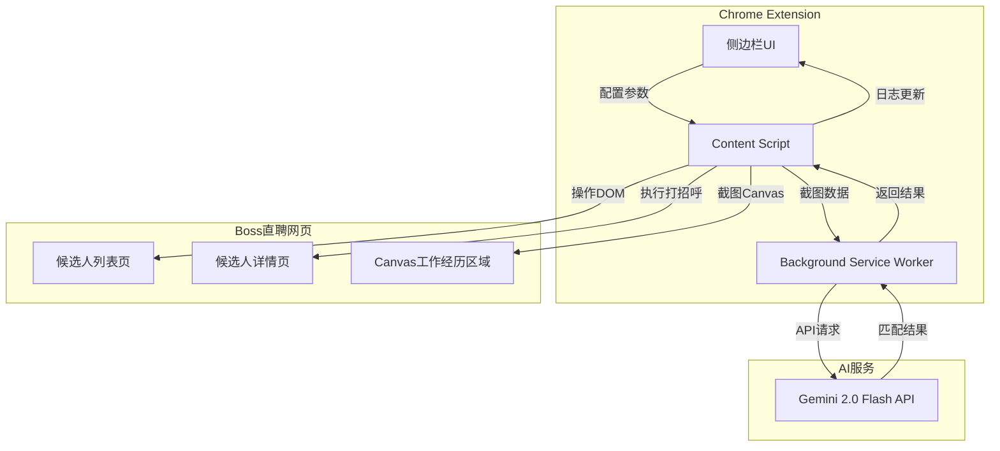
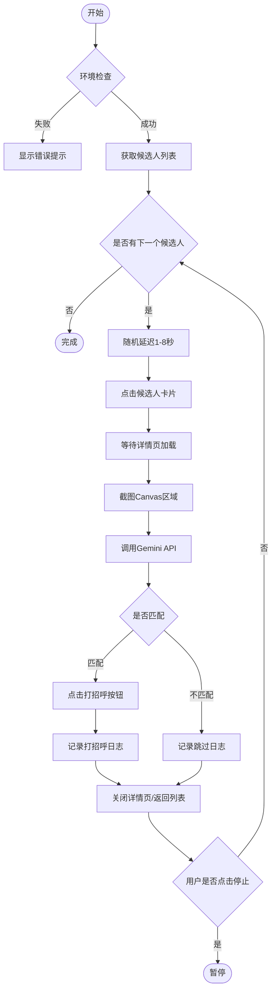
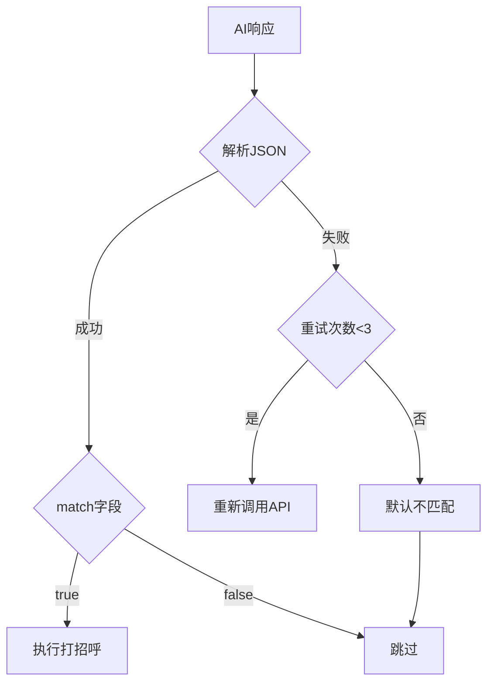
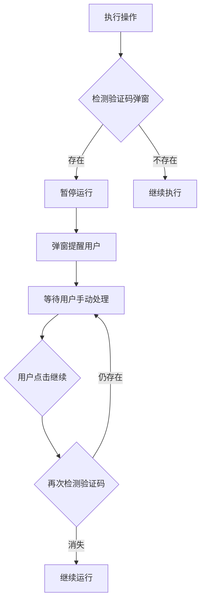
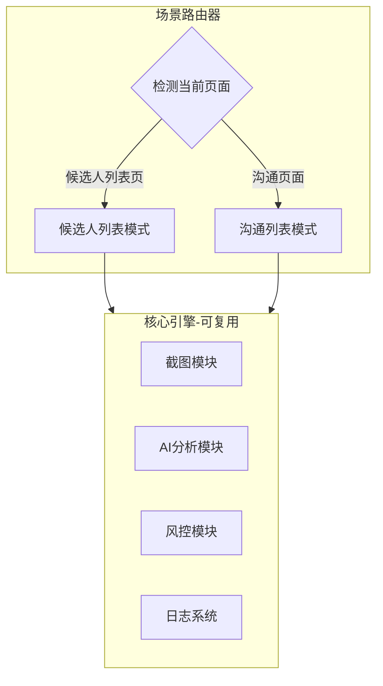

# Boss招聘智能打招呼助手 PRD v1.0

---

## 1. 产品概述

### 1.1 背景与痛点
HR在Boss直聘平台进行候选人筛选时，需要逐个点开候选人详情页，人工判断其工作经历、项目经历是否与岗位JD匹配。该流程重复性高、耗时长，严重影响招聘效率。

### 1.2 产品定位
一款Chrome浏览器侧边栏插件，通过AI自动识别候选人工作经历（Canvas截图+大模型分析），批量完成候选人筛选与打招呼操作，大幅提升HR工作效率。

### 1.3 目标用户
- Boss直聘平台的企业HR
- 猎头顾问
- 招聘专员

---

## 2. 核心功能架构



---

## 3. 详细功能规格

### 3.1 侧边栏交互设计

#### 3.1.1 UI布局结构

```
+----------------------------------+
|  Boss招聘智能助手                 |
+----------------------------------+
|  [API Key配置区]                  |
|  Gemini API Key: [**********]    |
|  [保存] [测试连接]                |
+----------------------------------+
|  [参数配置区]                     |
|  循环候选人数量: [50 ▼]           |
|  ⚠️ 建议不超过100人/天，降低封号风险|
|                                  |
|  职位描述JD:                      |
|  +----------------------------+  |
|  | [多行文本输入框]            |  |
|  | 请输入岗位要求、核心技能等  |  |
|  +----------------------------+  |
|                                  |
|  操作间隔: [3-8秒 ▼] (随机)       |
+----------------------------------+
|  [====== 开始打招呼 ======]      |
+----------------------------------+
|  [运行状态区]                     |
|  状态: 运行中 (15/50)             |
|  匹配: 8人 | 不匹配: 7人          |
|  已打招呼: 8人                    |
+----------------------------------+
|  [运行日志区] [导出日志]          |
|  +----------------------------+  |
|  | 10:23:15 张三 匹配 已打招呼 |  |
|  | 10:23:08 李四 不匹配 跳过   |  |
|  | 10:22:55 王五 匹配 已打招呼 |  |
|  | ...                        |  |
|  +----------------------------+  |
+----------------------------------+
```

#### 3.1.2 交互状态流转

| 状态 | 按钮文案 | 按钮样式 | 可编辑项 |
|------|---------|---------|---------|
| 初始状态 | 开始打招呼 | 主色调(蓝) | 全部可编辑 |
| 运行中 | 停止 | 警告色(红) | 全部禁用 |
| 已停止 | 继续 / 重新开始 | 主色调 | 全部可编辑 |
| 已完成 | 重新开始 | 主色调 | 全部可编辑 |
| 异常中断 | 重试 | 警告色 | 全部可编辑 |

#### 3.1.3 提示信息设计

| 场景 | 提示类型 | 提示内容 |
|------|---------|---------|
| 未配置API Key | Error Toast | 请先配置Gemini API Key |
| API Key测试失败 | Error Toast | API Key无效，请检查后重试 |
| 未输入JD | Error Toast | 请输入职位描述JD |
| JD字数过少(<20字) | Warning Toast | JD描述过短，可能影响匹配准确度 |
| 数量超过100 | Warning Toast | 建议每日不超过100人，降低封号风险 |
| 非Boss直聘页面 | Error Toast | 请在Boss直聘候选人列表页使用本插件 |
| 候选人列表为空 | Info Toast | 当前列表无候选人 |
| 运行完成 | Success Toast | 已完成！共处理X人，打招呼Y人 |
| 检测到验证码 | Error Alert | 检测到验证码弹窗，已暂停运行，请手动处理后点击继续 |

---

### 3.2 自动化操作流程

#### 3.2.1 主流程



#### 3.2.2 环境检查清单

1. 检查当前页面URL是否为Boss直聘候选人列表页
2. 检查API Key是否已配置且有效
3. 检查JD描述是否已填写
4. 检查候选人列表是否存在且非空

---

### 3.3 Canvas截图与AI识别

#### 3.3.1 截图获取策略

**方案一：captureVisibleTab (推荐)**
```
1. 定位Canvas所在区域的坐标位置
2. 调用chrome.tabs.captureVisibleTab()获取整页截图
3. 根据Canvas坐标裁剪目标区域
4. 转换为Base64编码
```

**方案二：Canvas toDataURL (备选)**
```
1. 直接访问Canvas元素
2. 调用canvas.toDataURL()导出图像
3. 注意：可能被跨域策略限制
```

#### 3.3.2 截图区域定位

需要截取的区域：
- 候选人基本信息区（姓名、年龄、学历、公司等）
- 工作经历区域（Canvas渲染）
- 项目经历区域（如有）

#### 3.3.3 JD匹配Prompts策略

**系统Prompt：**
```
你是一位资深的HR招聘助手。你的任务是根据岗位JD要求，分析候选人的工作经历截图，判断其是否符合岗位需求。

评判标准：
1. 核心技能匹配度：候选人是否具备JD中要求的核心技能
2. 行业经验相关性：候选人的行业背景是否与目标岗位相关
3. 工作年限：是否满足JD中的年限要求
4. 项目经验：是否有相关项目经验

输出要求：
- 仅输出JSON格式，不要输出任何其他内容
- 匹配阈值：满足60%以上核心要求即视为匹配
```

**用户Prompt模板：**
```
## 岗位JD要求
{user_input_jd}

## 任务
请分析上方图片中的候选人工作经历，判断是否符合上述岗位要求。

## 输出格式
请严格按以下JSON格式输出：
{
  "match": true/false,
  "confidence": 0.0-1.0,
  "reason": "简要说明匹配/不匹配的原因（50字以内）",
  "highlights": ["匹配的关键点1", "匹配的关键点2"]
}
```

#### 3.3.4 AI响应处理



---

### 3.4 风控策略（核心）

#### 3.4.1 随机延迟机制

| 操作类型 | 最小延迟 | 最大延迟 | 默认值 |
|---------|---------|---------|--------|
| 点击候选人卡片 | 1秒 | 3秒 | 2秒 |
| 等待详情页加载 | 1秒 | 2秒 | 1.5秒 |
| 截图前等待 | 0.5秒 | 1秒 | 0.8秒 |
| 点击打招呼按钮 | 0.5秒 | 1.5秒 | 1秒 |
| 关闭详情页 | 1秒 | 3秒 | 2秒 |
| 候选人间隔 | 3秒 | 8秒 | 5秒 |

**延迟计算公式：**
```
实际延迟 = 最小延迟 + Math.random() * (最大延迟 - 最小延迟)
```

#### 3.4.2 每日限额控制

| 限制项 | 限制值 | 说明 |
|-------|-------|------|
| 单次运行上限 | 100人 | 超过时强制提醒 |
| 每日打招呼上限 | 100次 | 本地存储计数，次日重置 |
| 连续运行时间上限 | 60分钟 | 超过后强制暂停5分钟 |

#### 3.4.3 验证码检测与处理



**验证码检测方式：**
- 监听DOM变化，检测验证码弹窗元素
- 检测页面是否跳转到验证页面
- 监听网络请求，检测风控接口响应

#### 3.4.4 异常行为规避

1. **鼠标轨迹模拟**：可选功能，模拟人类鼠标移动轨迹
2. **随机休息**：每处理20-30人，随机暂停30-60秒
3. **工作时间限制**：建议仅在工作时间（9:00-18:00）运行
4. **异常中断重试**：网络异常时，延迟30秒后重试

---

## 4. 数据结构设计

### 4.1 配置数据

```typescript
interface PluginConfig {
  apiKey: string;              // Gemini API Key
  candidateCount: number;      // 循环候选人数量 (1-100)
  jobDescription: string;      // 职位描述JD
  delayRange: {
    min: number;               // 最小延迟(秒)
    max: number;               // 最大延迟(秒)
  };
  enableMouseSimulation: boolean; // 是否启用鼠标轨迹模拟
}
```

### 4.2 运行日志数据

```typescript
interface OperationLog {
  id: string;                  // 日志ID
  timestamp: string;           // 时间戳
  candidateName: string;       // 候选人姓名
  candidateInfo: {
    age?: string;
    education?: string;
    company?: string;
    position?: string;
  };
  matchResult: boolean;        // 匹配结果
  matchConfidence: number;     // 匹配置信度
  matchReason: string;         // 匹配原因
  action: 'greeted' | 'skipped' | 'error'; // 执行动作
  errorMessage?: string;       // 错误信息
}
```

### 4.3 统计数据

```typescript
interface DailyStats {
  date: string;                // 日期
  totalProcessed: number;      // 总处理数
  totalMatched: number;        // 匹配数
  totalGreeted: number;        // 打招呼数
  totalSkipped: number;        // 跳过数
  totalErrors: number;         // 错误数
}
```

---

## 5. 日志导出功能

### 5.1 导出格式

**TXT格式：**
```
Boss招聘智能助手 - 运行日志
导出时间: 2024-01-15 18:30:00
运行统计: 处理50人, 匹配20人, 打招呼20人

========================================
[10:23:15] 张三 | 25岁 | 本科 | 字节跳动-前端工程师
匹配结果: 符合 (置信度: 0.85)
原因: 3年React经验，符合前端开发要求
动作: 已打招呼

[10:23:08] 李四 | 28岁 | 硕士 | 阿里巴巴-后端工程师
匹配结果: 不符合 (置信度: 0.30)
原因: 后端背景，缺乏前端经验
动作: 跳过
========================================
```

---

## 6. 错误处理与边界场景

| 场景 | 处理方式 |
|------|---------|
| 网络超时 | 重试3次，每次间隔递增(5s/10s/15s) |
| API调用失败 | 显示错误详情，暂停运行 |
| Canvas截图失败 | 跳过当前候选人，记录错误日志 |
| JSON解析失败 | 重试1次，仍失败则默认不匹配 |
| 候选人详情页加载失败 | 等待10秒后重试，仍失败则跳过 |
| 打招呼按钮不存在 | 可能已打过招呼，记录日志并跳过 |
| 页面DOM结构变化 | 提示用户更新插件 |

---

## 7. 权限声明

Chrome Extension所需权限：

| 权限 | 用途 |
|------|------|
| activeTab | 访问当前标签页 |
| scripting | 注入Content Script |
| storage | 存储配置和日志 |
| sidePanel | 侧边栏UI |
| tabs | 截图功能 |
| host_permissions: zhipin.com | 操作Boss直聘页面 |

---

## 8. 技术约束

1. **浏览器兼容性**：仅支持Chrome 116+（Manifest V3 + Side Panel）
2. **API依赖**：Gemini 2.0 Flash API（需用户自行配置Key）
3. **网络要求**：需稳定网络连接
4. **页面依赖**：依赖Boss直聘当前DOM结构，结构变更需适配

---

## 9. 产品边界（本期不做）

| 功能 | 决策 | 说明 |
|------|------|------|
| 多JD模板切换 | 不做 | 直接在输入框修改JD描述即可 |
| 候选人黑/白名单 | 不做 | MVP阶段不需要 |
| 日志云端同步 | 不做 | 本地存储即可 |
| 其他招聘平台 | 不做 | 仅支持Boss直聘 |

---

## 10. 未来扩展场景（本期仅预留架构）

### 10.1 沟通页面批量操作

**场景描述：**
在Boss直聘「沟通」页面，HR需要对聊天列表中的候选人进行批量操作：
1. 挨个发送消息索要简历
2. 或先点击头像查看候选人详情，判断是否符合JD，符合再发消息要简历

**预留架构设计：**



**架构预留要点：**

1. **场景路由器**：Content Script检测当前页面URL，分发到不同的操作模式
   - `/web/geek/recommend` → 候选人推荐列表模式（本期实现）
   - `/web/geek/chat` → 沟通列表模式（未来扩展）

2. **可复用核心模块**：
   - 截图模块：复用Canvas截图逻辑
   - AI分析模块：复用JD匹配Prompts
   - 风控模块：复用随机延迟、验证码检测
   - 日志系统：复用日志记录与导出

3. **扩展点预留**：
   - 侧边栏UI预留「模式切换」入口（隐藏状态）
   - 配置数据结构预留`operationMode`字段
   - 操作日志预留`scene`字段标识来源场景

```typescript
// 预留的配置扩展
interface PluginConfig {
  // ... 现有字段
  operationMode: 'candidate_list' | 'chat_list';  // 预留
}

// 预留的日志扩展
interface OperationLog {
  // ... 现有字段
  scene: 'recommend' | 'chat';  // 预留
}
```

---

## 附录：DOM元素参考（待补充）

需要HR提供以下元素的XPath/CSS Selector：
- 候选人列表容器
- 候选人卡片元素
- 候选人详情页触发元素
- Canvas工作经历区域
- 打招呼按钮
- 关闭/返回按钮
- 验证码弹窗容器

