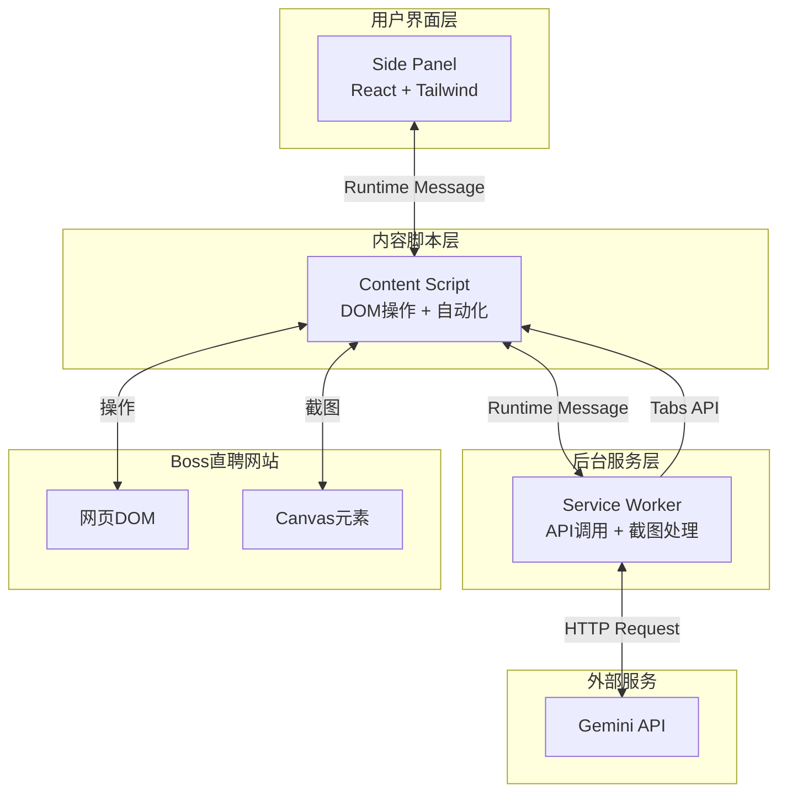

# Boss招聘智能打招呼助手 - 技术方案文档 v1.0

---

## 1. 概述

### 1.1 项目背景
基于 [`PRD.md`](PRD.md) 和 [`DOM选择器信息.md`](DOM选择器信息.md)，本技术方案旨在快速实现MVP版本，采用 **React + TypeScript + Tailwind CSS** 技术栈，构建一个Chrome Manifest V3扩展程序，实现Boss直聘候选人智能筛选与自动打招呼功能。

### 1.2 核心目标
- **快速开发**: MVP版本7天内完成
- **轻量架构**: 最小化依赖，保证性能
- **规范代码**: TypeScript严格模式，遵循最佳实践
- **稳定可靠**: 完善的错误处理和风控机制

---

## 2. 技术架构

### 2.1 核心技术栈

| 技术 | 版本 | 用途 |
|------|------|------|
| React | 18.3.1 | UI框架 |
| TypeScript | 5.5+ | 类型安全 |
| Tailwind CSS | 3.4+ | 样式方案 |
| Vite | 5.4+ | 构建工具 |
| CRXJS | 2.0+ | Chrome扩展开发插件 |
| Zustand | 4.5+ | 轻量级状态管理 |
| Gemini 2.5 Flash | API | AI图像识别 |

### 2.2 Chrome Extension架构



### 2.3 项目目录结构

```
boss-greeting-assistant/
├── public/
│   ├── icons/
│   │   ├── icon-16.png
│   │   ├── icon-48.png
│   │   └── icon-128.png
│   └── manifest.json              # Manifest V3配置
│
├── src/
│   ├── sidepanel/                 # 侧边栏UI
│   │   ├── App.tsx                # 主应用组件
│   │   ├── main.tsx               # React入口
│   │   ├── index.html             # HTML模板
│   │   ├── components/            # UI组件
│   │   │   ├── ConfigSection.tsx
│   │   │   ├── ParameterSection.tsx
│   │   │   ├── ControlSection.tsx
│   │   │   ├── StatusSection.tsx
│   │   │   └── LogSection.tsx
│   │   ├── hooks/                 # 自定义Hooks
│   │   │   ├── useConfig.ts
│   │   │   └── useAutomation.ts
│   │   └── store/                 # Zustand状态管理
│   │       └── app-store.ts
│   │
│   ├── content/                   # Content Script
│   │   ├── index.ts               # 入口文件
│   │   ├── dom-selectors.ts       # DOM选择器配置
│   │   ├── candidate-handler.ts   # 候选人处理器
│   │   ├── candidate-extractor.ts # 信息提取器
│   │   ├── automation-controller.ts # 自动化控制器
│   │   └── captcha-detector.ts    # 验证码检测
│   │
│   ├── background/                # Service Worker
│   │   ├── index.ts               # 入口文件
│   │   ├── gemini-service.ts      # Gemini API服务
│   │   ├── screenshot-service.ts  # 截图处理服务
│   │   ├── storage-service.ts     # 数据存储服务
│   │   └── message-handler.ts     # 消息处理器
│   │
│   ├── shared/                    # 共享模块
│   │   ├── types.ts               # TypeScript类型定义
│   │   ├── constants.ts           # 常量配置
│   │   ├── utils.ts               # 工具函数
│   │   ├── message-types.ts       # 消息类型定义
│   │   └── prompts.ts             # AI Prompts配置
│   │
│   └── assets/                    # 静态资源
│       └── styles/
│           └── globals.css
│
├── package.json
├── tsconfig.json
├── tailwind.config.js
├── vite.config.ts
├── .eslintrc.cjs
├── .prettierrc
└── README.md
```

---

## 3. 核心模块详细设计

### 3.1 DOM选择器模块

**文件**: `src/content/dom-selectors.ts`

```typescript
/**
 * Boss直聘DOM选择器配置
 * 基于实际页面结构提取的稳定选择器
 */
export const DOM_SELECTORS = {
  // 候选人列表页
  LIST_CONTAINER: '#recommend-list',
  CARD_LIST: 'ul.card-list',
  CARD_ITEM: 'li.card-item',
  CARD_INNER: '.card-inner.common-wrap',
  CARD_INFO_COL: '.col-2',
  
  // 候选人基本信息
  CANDIDATE_NAME: '.name-wrap .name',
  ACTIVE_STATUS: '.active-text',
  BASE_INFO: '.base-info.join-text-wrap',
  GEEK_DESC: '.geek-desc .content',
  TAGS: '.tags-wrap .tag-item',
  
  // 工作与教育经历
  WORK_TIMELINE: '.timeline-wrap.work-exps',
  EDU_TIMELINE: '.timeline-wrap.edu-exps',
  TIMELINE_ITEM: '.timeline-item',
  
  // 详情页（弹窗）
  DETAIL_DIALOG: '[class*="dialog-lib-resume"]',
  DIALOG_WRAPPER: '.boss-dialog__wrapper',
  RESUME_CONTAINER: '#resume',
  RESUME_CANVAS: 'canvas#resume',
  
  // 操作按钮
  GREET_BUTTON_IN_LIST: 'button.btn-greet',
  GREET_BUTTON_IN_DETAIL: '.communication button.btn-greet',
  CLOSE_BUTTON: '.boss-popup__close .icon-close',
  
  // 风控相关
  CAPTCHA_MODAL: '[class*="captcha"]',
  CAPTCHA_CONTAINER: '#captcha-container',
} as const;

/**
 * 工具函数：获取候选人唯一ID
 */
export function getCandidateId(cardElement: HTMLElement): string | null {
  const cardInner = cardElement.querySelector(DOM_SELECTORS.CARD_INNER);
  return cardInner?.getAttribute('data-geekid') || null;
}

/**
 * 工具函数：等待元素出现
 */
export function waitForElement(
  selector: string,
  timeout: number = 10000
): Promise<Element> {
  return new Promise((resolve, reject) => {
    const element = document.querySelector(selector);
    if (element) {
      resolve(element);
      return;
    }
    
    const observer = new MutationObserver(() => {
      const element = document.querySelector(selector);
      if (element) {
        observer.disconnect();
        resolve(element);
      }
    });
    
    observer.observe(document.body, {
      childList: true,
      subtree: true,
    });
    
    setTimeout(() => {
      observer.disconnect();
      reject(new Error(`Element ${selector} not found within ${timeout}ms`));
    }, timeout);
  });
}

/**
 * 工具函数：检查当前页面是否为Boss直聘候选人列表页
 */
export function isCandidateListPage(): boolean {
  const url = window.location.href;
  return (
    url.includes('zhipin.com/web/geek/recommend') ||
    url.includes('zhipin.com/web/geek/job')
  );
}
```

---

### 3.2 候选人信息提取器

**文件**: `src/content/candidate-extractor.ts`

```typescript
import { DOM_SELECTORS, getCandidateId } from './dom-selectors';
import type { CandidateInfo } from '../shared/types';

/**
 * 候选人信息提取器
 */
export class CandidateExtractor {
  /**
   * 从候选人卡片中提取基本信息
   */
  static extractFromCard(cardElement: HTMLElement): CandidateInfo {
    const candidateId = getCandidateId(cardElement);
    const name = this.extractName(cardElement);
    const baseInfo = this.extractBaseInfo(cardElement);
    const workExperience = this.extractWorkExperience(cardElement);
    const education = this.extractEducation(cardElement);
    const tags = this.extractTags(cardElement);
    const desc = this.extractDescription(cardElement);
    
    return {
      id: candidateId || '',
      name,
      ...baseInfo,
      workExperience,
      education,
      tags,
      description: desc,
    };
  }
  
  private static extractName(element: HTMLElement): string {
    return element.querySelector(DOM_SELECTORS.CANDIDATE_NAME)?.textContent?.trim() || '未知';
  }
  
  private static extractBaseInfo(element: HTMLElement) {
    const baseInfoText = element.querySelector(DOM_SELECTORS.BASE_INFO)?.textContent || '';
    
    // 解析格式: "28岁 | 3年 | 硕士 | 在职-月内到岗"
    const parts = baseInfoText.split('|').map(s => s.trim());
    
    return {
      age: parts[0] || '',
      workYears: parts[1] || '',
      education: parts[2] || '',
      status: parts[3] || '',
    };
  }
  
  private static extractWorkExperience(element: HTMLElement): string[] {
    const workTimeline = element.querySelector(DOM_SELECTORS.WORK_TIMELINE);
    if (!workTimeline) return [];
    
    const items = workTimeline.querySelectorAll(DOM_SELECTORS.TIMELINE_ITEM);
    return Array.from(items).map(item => item.textContent?.trim() || '');
  }
  
  private static extractEducation(element: HTMLElement): string[] {
    const eduTimeline = element.querySelector(DOM_SELECTORS.EDU_TIMELINE);
    if (!eduTimeline) return [];
    
    const items = eduTimeline.querySelectorAll(DOM_SELECTORS.TIMELINE_ITEM);
    return Array.from(items).map(item => item.textContent?.trim() || '');
  }
  
  private static extractTags(element: HTMLElement): string[] {
    const tagElements = element.querySelectorAll(DOM_SELECTORS.TAGS);
    return Array.from(tagElements).map(tag => tag.textContent?.trim() || '');
  }
  
  private static extractDescription(element: HTMLElement): string {
    return element.querySelector(DOM_SELECTORS.GEEK_DESC)?.textContent?.trim() || '';
  }
}
```

---

### 3.3 截图服务

**文件**: `src/background/screenshot-service.ts`

```typescript
/**
 * 截图服务
 * 负责捕获Canvas区域并裁剪
 */
export class ScreenshotService {
  /**
   * 捕获指定区域的截图
   */
  static async captureArea(rect: DOMRect): Promise<string> {
    try {
      // 1. 获取当前活动标签页
      const [tab] = await chrome.tabs.query({ active: true, currentWindow: true });
      if (!tab?.id) {
        throw new Error('No active tab found');
      }
      
      // 2. 捕获整页截图
      const dataUrl = await chrome.tabs.captureVisibleTab(tab.windowId!, {
        format: 'png',
      });
      
      // 3. 裁剪指定区域
      const croppedDataUrl = await this.cropImage(dataUrl, rect);
      
      return croppedDataUrl;
    } catch (error) {
      console.error('Screenshot capture failed:', error);
      throw error;
    }
  }
  
  /**
   * 裁剪图片
   */
  private static async cropImage(dataUrl: string, rect: DOMRect): Promise<string> {
    return new Promise((resolve, reject) => {
      const img = new Image();
      
      img.onload = () => {
        const canvas = new OffscreenCanvas(rect.width, rect.height);
        const ctx = canvas.getContext('2d');
        
        if (!ctx) {
          reject(new Error('Failed to get canvas context'));
          return;
        }
        
        // 绘制裁剪后的图像
        ctx.drawImage(
          img,
          rect.x, rect.y, rect.width, rect.height,
          0, 0, rect.width, rect.height
        );
        
        // 转换为Blob再转为Base64
        canvas.convertToBlob({ type: 'image/png' }).then(blob => {
          const reader = new FileReader();
          reader.onloadend = () => {
            const base64 = (reader.result as string).split(',')[1];
            resolve(base64);
          };
          reader.onerror = reject;
          reader.readAsDataURL(blob);
        });
      };
      
      img.onerror = () => reject(new Error('Failed to load image'));
      img.src = dataUrl;
    });
  }
}
```

---

### 3.4 Gemini AI服务

**文件**: `src/background/gemini-service.ts`

```typescript
import { SYSTEM_PROMPT, buildUserPrompt } from '../shared/prompts';
import type { MatchResult } from '../shared/types';

/**
 * Gemini API服务
 */
export class GeminiService {
  private apiKey: string;
  private readonly apiEndpoint = 'https://generativelanguage.googleapis.com/v1beta/models/gemini-2.0-flash-exp:generateContent';
  
  constructor(apiKey: string) {
    this.apiKey = apiKey;
  }
  
  /**
   * 分析候选人是否匹配JD要求
   */
  async analyzeCandidate(
    imageBase64: string,
    jobDescription: string
  ): Promise<MatchResult> {
    try {
      const userPrompt = buildUserPrompt(jobDescription);
      
      const response = await fetch(this.apiEndpoint, {
        method: 'POST',
        headers: {
          'Content-Type': 'application/json',
          'x-goog-api-key': this.apiKey,
        },
        body: JSON.stringify({
          contents: [
            {
              role: 'user',
              parts: [
                { text: SYSTEM_PROMPT + '\n\n' + userPrompt },
                {
                  inline_data: {
                    mime_type: 'image/png',
                    data: imageBase64,
                  },
                },
              ],
            },
          ],
          generationConfig: {
            temperature: 0.2,
            topK: 40,
            topP: 0.95,
            maxOutputTokens: 1024,
          },
        }),
      });
      
      if (!response.ok) {
        throw new Error(`Gemini API error: ${response.status} ${response.statusText}`);
      }
      
      const data = await response.json();
      return this.parseResponse(data);
      
    } catch (error) {
      console.error('Gemini API call failed:', error);
      throw error;
    }
  }
  
  /**
   * 解析AI响应
   */
  private parseResponse(data: any): MatchResult {
    try {
      const textContent = data.candidates?.[0]?.content?.parts?.[0]?.text || '';
      
      // 尝试提取JSON
      const jsonMatch = textContent.match(/\{[\s\S]*\}/);
      if (!jsonMatch) {
        throw new Error('No JSON found in response');
      }
      
      const result = JSON.parse(jsonMatch[0]);
      
      // 验证必需字段
      if (typeof result.match !== 'boolean') {
        throw new Error('Invalid match field');
      }
      
      return {
        match: result.match,
        confidence: result.confidence || 0.5,
        reason: result.reason || '未提供原因',
        highlights: result.highlights || [],
      };
      
    } catch (error) {
      console.error('Failed to parse Gemini response:', error);
      // 降级策略：默认不匹配
      return {
        match: false,
        confidence: 0,
        reason: '解析AI响应失败',
        highlights: [],
      };
    }
  }
  
  /**
   * 测试API Key是否有效
   */
  async testApiKey(): Promise<boolean> {
    try {
      const testPrompt = 'Hello, are you working?';
      
      const response = await fetch(this.apiEndpoint, {
        method: 'POST',
        headers: {
          'Content-Type': 'application/json',
          'x-goog-api-key': this.apiKey,
        },
        body: JSON.stringify({
          contents: [{ role: 'user', parts: [{ text: testPrompt }] }],
        }),
      });
      
      return response.ok;
    } catch {
      return false;
    }
  }
}
```

---

### 3.5 AI Prompts配置

**文件**: `src/shared/prompts.ts`

```typescript
/**
 * 系统Prompt
 */
export const SYSTEM_PROMPT = `你是一位资深的HR招聘助手。你的任务是根据岗位JD要求，分析候选人的工作经历截图，判断其是否符合岗位需求。

评判标准：
1. 核心技能匹配度：候选人是否具备JD中要求的核心技能
2. 行业经验相关性：候选人的行业背景是否与目标岗位相关
3. 工作年限：是否满足JD中的年限要求
4. 项目经验：是否有相关项目经验

输出要求：
- 仅输出JSON格式，不要输出任何其他内容
- 匹配阈值：满足60%以上核心要求即视为匹配
- JSON必须严格遵循指定格式`;

/**
 * 构建用户Prompt
 */
export function buildUserPrompt(jobDescription: string): string {
  return `## 岗位JD要求
${jobDescription}

## 任务
请分析上方图片中的候选人工作经历，判断是否符合上述岗位要求。

## 输出格式
请严格按以下JSON格式输出：
{
  "match": true或false,
  "confidence": 0.0-1.0之间的数字,
  "reason": "简要说明匹配/不匹配的原因（50字以内）",
  "highlights": ["匹配的关键点1", "匹配的关键点2"]
}`;
}
```

---

### 3.6 风控模块

**文件**: `src/content/risk-control.ts`

```typescript
import { DOM_SELECTORS } from './dom-selectors';
import type { DelayConfig } from '../shared/types';

/**
 * 风控模块
 * 负责随机延迟、验证码检测、每日限额等风控策略
 */
export class RiskControl {
  /**
   * 随机延迟
   */
  static async randomDelay(min: number, max: number): Promise<void> {
    const delay = min + Math.random() * (max - min);
    await new Promise(resolve => setTimeout(resolve, delay * 1000));
  }
  
  /**
   * 根据操作类型获取延迟配置
   */
  static getDelayConfig(operationType: string): DelayConfig {
    const configs: Record<string, DelayConfig> = {
      clickCard: { min: 1, max: 3 },
      waitLoad: { min: 1, max: 2 },
      beforeScreenshot: { min: 0.5, max: 1 },
      clickGreet: { min: 0.5, max: 1.5 },
      closeDetail: { min: 1, max: 3 },
      betweenCandidates: { min: 3, max: 8 },
    };
    
    return configs[operationType] || { min: 1, max: 2 };
  }
  
  /**
   * 检测验证码
   */
  static detectCaptcha(): boolean {
    return !!(
      document.querySelector(DOM_SELECTORS.CAPTCHA_MODAL) ||
      document.querySelector(DOM_SELECTORS.CAPTCHA_CONTAINER)
    );
  }
  
  /**
   * 检查每日限额
   */
  static async checkDailyLimit(): Promise<{ allowed: boolean; remaining: number }> {
    const result = await chrome.storage.local.get('dailyStats');
    const today = new Date().toISOString().split('T')[0];
    
    if (!result.dailyStats || result.dailyStats.date !== today) {
      // 新的一天，重置计数
      return { allowed: true, remaining: 100 };
    }
    
    const { totalGreeted = 0 } = result.dailyStats;
    const remaining = Math.max(0, 100 - totalGreeted);
    
    return {
      allowed: remaining > 0,
      remaining,
    };
  }
  
  /**
   * 更新每日统计
   */
  static async updateDailyStats(greeted: boolean): Promise<void> {
    const result = await chrome.storage.local.get('dailyStats');
    const today = new Date().toISOString().split('T')[0];
    
    let stats = result.dailyStats || { date: today, totalGreeted: 0 };
    
    if (stats.date !== today) {
      stats = { date: today, totalGreeted: 0 };
    }
    
    if (greeted) {
      stats.totalGreeted += 1;
    }
    
    await chrome.storage.local.set({ dailyStats: stats });
  }
  
  /**
   * 随机休息（每处理N个候选人后）
   */
  static async randomBreak(processedCount: number): Promise<void> {
    const breakInterval = 20 + Math.floor(Math.random() * 11); // 20-30
    
    if (processedCount > 0 && processedCount % breakInterval === 0) {
      const breakTime = 30 + Math.random() * 30; // 30-60秒
      console.log(`[RiskControl] Taking a break for ${breakTime.toFixed(1)} seconds...`);
      await new Promise(resolve => setTimeout(resolve, breakTime * 1000));
    }
  }
  
  /**
   * 检查是否在工作时间（可选风控）
   */
  static isWorkingHours(): boolean {
    const now = new Date();
    const hour = now.getHours();
    return hour >= 9 && hour < 18;
  }
}
```

---

### 3.7 候选人处理器

**文件**: `src/content/candidate-handler.ts`

```typescript
import { DOM_SELECTORS, waitForElement } from './dom-selectors';
import { CandidateExtractor } from './candidate-extractor';
import { RiskControl } from './risk-control';
import type { OperationLog, PluginConfig } from '../shared/types';

/**
 * 候选人处理器
 * 负责单个候选人的完整处理流程
 */
export class CandidateHandler {
  /**
   * 处理单个候选人
   */
  async processCandidate(
    cardElement: HTMLElement,
    config: PluginConfig
  ): Promise<OperationLog> {
    const log: Partial<OperationLog> = {
      id: Date.now().toString(),
      timestamp: new Date().toISOString(),
    };
    
    try {
      // 1. 提取候选人基本信息
      const candidateInfo = CandidateExtractor.extractFromCard(cardElement);
      log.candidateName = candidateInfo.name;
      log.candidateInfo = {
        age: candidateInfo.age,
        education: candidateInfo.education,
        company: candidateInfo.workExperience[0] || '',
        position: '',
      };
      
      // 2. 随机延迟后点击卡片
      const clickDelay = RiskControl.getDelayConfig('clickCard');
      await RiskControl.randomDelay(clickDelay.min, clickDelay.max);
      await this.clickCard(cardElement);
      
      // 3. 等待详情页加载
      await waitForElement(DOM_SELECTORS.DETAIL_DIALOG, 10000);
      const loadDelay = RiskControl.getDelayConfig('waitLoad');
      await RiskControl.randomDelay(loadDelay.min, loadDelay.max);
      
      // 4. 检查验证码
      if (RiskControl.detectCaptcha()) {
        throw new Error('检测到验证码，已暂停');
      }
      
      // 5. 截图前等待
      const screenshotDelay = RiskControl.getDelayConfig('beforeScreenshot');
      await RiskControl.randomDelay(screenshotDelay.min, screenshotDelay.max);
      
      // 6. 获取Canvas位置并截图
      const canvasContainer = document.querySelector(DOM_SELECTORS.RESUME_CONTAINER);
      if (!canvasContainer) {
        throw new Error('未找到简历Canvas容器');
      }
      
      const rect = canvasContainer.getBoundingClientRect();
      
      // 7. 发送消息到Background进行截图和AI分析
      const response = await chrome.runtime.sendMessage({
        type: 'ANALYZE_CANDIDATE',
        payload: {
          rect: {
            x: rect.x,
            y: rect.y,
            width: rect.width,
            height: rect.height,
          },
          jobDescription: config.jobDescription,
        },
      });
      
      if (response.error) {
        throw new Error(response.error);
      }
      
      log.matchResult = response.result.match;
      log.matchConfidence = response.result.confidence;
      log.matchReason = response.result.reason;
      
      // 8. 根据匹配结果决定是否打招呼
      if (response.result.match) {
        const greetDelay = RiskControl.getDelayConfig('clickGreet');
        await RiskControl.randomDelay(greetDelay.min, greetDelay.max);
        await this.clickGreetButton();
        log.action = 'greeted';
        
        // 更新每日统计
        await RiskControl.updateDailyStats(true);
      } else {
        log.action = 'skipped';
      }
      
      // 9. 关闭详情页
      const closeDelay = RiskControl.getDelayConfig('closeDetail');
      await RiskControl.randomDelay(closeDelay.min, closeDelay.max);
      await this.closeDetail();
      
      return log as OperationLog;
      
    } catch (error: any) {
      log.action = 'error';
      log.errorMessage = error.message || '未知错误';
      
      // 尝试关闭详情页
      try {
        await this.closeDetail();
      } catch {}
      
      return log as OperationLog;
    }
  }
  
  /**
   * 点击候选人卡片
   */
  private async clickCard(cardElement: HTMLElement): Promise<void> {
    const cardInner = cardElement.querySelector(DOM_SELECTORS.CARD_INNER) as HTMLElement;
    if (!cardInner) {
      throw new Error('未找到可点击的候选人卡片');
    }
    
    cardInner.click();
  }
  
  /**
   * 点击打招呼按钮
   */
  private async clickGreetButton(): Promise<void> {
    const button = document.querySelector(DOM_SELECTORS.GREET_BUTTON_IN_DETAIL) as HTMLButtonElement;
    if (!button) {
      throw new Error('未找到打招呼按钮，可能已经打过招呼');
    }
    
    if (button.disabled) {
      throw new Error('打招呼按钮已禁用');
    }
    
    button.click();
  }
  
  /**
   * 关闭详情页
   */
  private async closeDetail(): Promise<void> {
    const closeButton = document.querySelector(DOM_SELECTORS.CLOSE_BUTTON) as HTMLElement;
    if (closeButton) {
      closeButton.click();
      await new Promise(resolve => setTimeout(resolve, 500));
    }
  }
}
```

---

## 4. 数据类型定义

**文件**: `src/shared/types.ts`

```typescript
/**
 * 插件配置
 */
export interface PluginConfig {
  apiKey: string;
  candidateCount: number;
  jobDescription: string;
  delayRange: {
    min: number;
    max: number;
  };
  enableMouseSimulation: boolean;
}

/**
 * 候选人信息
 */
export interface CandidateInfo {
  id: string;
  name: string;
  age: string;
  workYears: string;
  education: string;
  status: string;
  workExperience: string[];
  education: string[];
  tags: string[];
  description: string;
}

/**
 * 匹配结果
 */
export interface MatchResult {
  match: boolean;
  confidence: number;
  reason: string;
  highlights: string[];
}

/**
 * 操作日志
 */
export interface OperationLog {
  id: string;
  timestamp: string;
  candidateName: string;
  candidateInfo: {
    age?: string;
    education?: string;
    company?: string;
    position?: string;
  };
  matchResult: boolean;
  matchConfidence: number;
  matchReason: string;
  action: 'greeted' | 'skipped' | 'error';
  errorMessage?: string;
}

/**
 * 每日统计
 */
export interface DailyStats {
  date: string;
  totalProcessed: number;
  totalMatched: number;
  totalGreeted: number;
  totalSkipped: number;
  totalErrors: number;
}

/**
 * 延迟配置
 */
export interface DelayConfig {
  min: number;
  max: number;
}

/**
 * 应用状态
 */
export interface AppState {
  status: 'idle' | 'running' | 'paused' | 'completed' | 'error';
  config: PluginConfig;
  stats: {
    processed: number;
    matched: number;
    greeted: number;
    skipped: number;
  };
  logs: OperationLog[];
}
```

---

## 5. 消息通信机制

**文件**: `src/shared/message-types.ts`

```typescript
/**
 * 消息类型定义
 */
export enum MessageType {
  // Side Panel -> Content Script
  START_AUTOMATION = 'START_AUTOMATION',
  STOP_AUTOMATION = 'STOP_AUTOMATION',
  PAUSE_AUTOMATION = 'PAUSE_AUTOMATION',
  RESUME_AUTOMATION = 'RESUME_AUTOMATION',
  
  // Content Script -> Background
  ANALYZE_CANDIDATE = 'ANALYZE_CANDIDATE',
  TEST_API_KEY = 'TEST_API_KEY',
  
  // Background -> Side Panel
  LOG_UPDATE = 'LOG_UPDATE',
  STATUS_UPDATE = 'STATUS_UPDATE',
  ERROR_OCCURRED = 'ERROR_OCCURRED',
  
  // Content Script -> Side Panel
  CAPTCHA_DETECTED = 'CAPTCHA_DETECTED',
  AUTOMATION_COMPLETE = 'AUTOMATION_COMPLETE',
}

/**
 * 消息基类
 */
export interface Message<T = any> {
  type: MessageType;
  payload?: T;
}

/**
 * 响应基类
 */
export interface Response<T = any> {
  success: boolean;
  result?: T;
  error?: string;
}
```

---

## 6. 侧边栏UI实现

### 6.1 Zustand状态管理

**文件**: `src/sidepanel/store/app-store.ts`

```typescript
import { create } from 'zustand';
import type { AppState, PluginConfig, OperationLog } from '../../shared/types';

interface AppStore extends AppState {
  updateConfig: (config: Partial<PluginConfig>) => void;
  setStatus: (status: AppState['status']) => void;
  updateStats: (stats: Partial<AppState['stats']>) => void;
  addLog: (log: OperationLog) => void;
  clearLogs: () => void;
  reset: () => void;
}

const defaultConfig: PluginConfig = {
  apiKey: '',
  candidateCount: 50,
  jobDescription: '',
  delayRange: { min: 3, max: 8 },
  enableMouseSimulation: false,
};

export const useAppStore = create<AppStore>((set) => ({
  status: 'idle',
  config: defaultConfig,
  stats: {
    processed: 0,
    matched: 0,
    greeted: 0,
    skipped: 0,
  },
  logs: [],
  
  updateConfig: (config) =>
    set((state) => ({
      config: { ...state.config, ...config },
    })),
  
  setStatus: (status) => set({ status }),
  
  updateStats: (stats) =>
    set((state) => ({
      stats: { ...state.stats, ...stats },
    })),
  
  addLog: (log) =>
    set((state) => ({
      logs: [log, ...state.logs],
    })),
  
  clearLogs: () => set({ logs: [] }),
  
  reset: () =>
    set({
      status: 'idle',
      stats: {
        processed: 0,
        matched: 0,
        greeted: 0,
        skipped: 0,
      },
    }),
}));
```

### 6.2 主应用组件

**文件**: `src/sidepanel/App.tsx`

```typescript
import React from 'react';
import { ConfigSection } from './components/ConfigSection';
import { ParameterSection } from './components/ParameterSection';
import { ControlSection } from './components/ControlSection';
import { StatusSection } from './components/StatusSection';
import { LogSection } from './components/LogSection';
import { useAppStore } from './store/app-store';

export default function App() {
  const { status } = useAppStore();
  
  return (
    <div className="min-h-screen bg-gray-50 p-4">
      <header className="mb-6">
        <h1 className="text-2xl font-bold text-gray-800">
          Boss招聘智能助手
        </h1>
        <p className="text-sm text-gray-500 mt-1">
          AI驱动的候选人智能筛选工具
        </p>
      </header>
      
      <main className="space-y-4">
        <ConfigSection />
        <ParameterSection disabled={status === 'running'} />
        <ControlSection />
        <StatusSection />
        <LogSection />
      </main>
    </div>
  );
}
```

---

## 7. Manifest V3配置

**文件**: `public/manifest.json`

```json
{
  "manifest_version": 3,
  "name": "Boss招聘智能助手",
  "version": "1.0.0",
  "description": "AI驱动的Boss直聘候选人智能筛选与自动打招呼工具",
  "permissions": [
    "activeTab",
    "scripting",
    "storage",
    "sidePanel",
    "tabs"
  ],
  "host_permissions": [
    "https://*.zhipin.com/*"
  ],
  "background": {
    "service_worker": "src/background/index.ts",
    "type": "module"
  },
  "action": {
    "default_title": "Boss招聘智能助手"
  },
  "side_panel": {
    "default_path": "src/sidepanel/index.html"
  },
  "content_scripts": [
    {
      "matches": ["https://*.zhipin.com/*"],
      "js": ["src/content/index.ts"],
      "run_at": "document_idle"
    }
  ],
  "icons": {
    "16": "icons/icon-16.png",
    "48": "icons/icon-48.png",
    "128": "icons/icon-128.png"
  }
}
```

---

## 8. 构建配置

### 8.1 Vite配置

**文件**: `vite.config.ts`

```typescript
import { defineConfig } from 'vite';
import react from '@vitejs/plugin-react';
import { crx } from '@crxjs/vite-plugin';
import manifest from './public/manifest.json';

export default defineConfig({
  plugins: [
    react(),
    crx({ manifest }),
  ],
  build: {
    rollupOptions: {
      input: {
        sidepanel: 'src/sidepanel/index.html',
      },
    },
  },
});
```

### 8.2 Tailwind配置

**文件**: `tailwind.config.js`

```javascript
/** @type {import('tailwindcss').Config} */
export default {
  content: [
    "./src/**/*.{js,ts,jsx,tsx}",
  ],
  theme: {
    extend: {},
  },
  plugins: [],
}
```

### 8.3 TypeScript配置

**文件**: `tsconfig.json`

```json
{
  "compilerOptions": {
    "target": "ES2020",
    "useDefineForClassFields": true,
    "lib": ["ES2020", "DOM", "DOM.Iterable"],
    "module": "ESNext",
    "skipLibCheck": true,
    "moduleResolution": "bundler",
    "allowImportingTsExtensions": true,
    "resolveJsonModule": true,
    "isolatedModules": true,
    "noEmit": true,
    "jsx": "react-jsx",
    "strict": true,
    "noUnusedLocals": true,
    "noUnusedParameters": true,
    "noFallthroughCasesInSwitch": true,
    "types": ["chrome"]
  },
  "include": ["src"],
  "references": [{ "path": "./tsconfig.node.json" }]
}
```

---

## 9. MVP开发计划

### 第一阶段：基础框架（2天）

**Day 1**:
- [ ] 初始化项目，安装依赖
- [ ] 配置Vite + CRXJS + Tailwind
- [ ] 创建基础目录结构
- [ ] 实现Manifest V3配置
- [ ] 搭建Side Panel基础UI

**Day 2**:
- [ ] 实现Zustand状态管理
- [ ] 完成所有UI组件开发
- [ ] 实现消息通信框架
- [ ] 本地测试Side Panel功能

### 第二阶段：核心功能（3天）

**Day 3**:
- [ ] 实现DOM选择器模块
- [ ] 实现候选人信息提取器
- [ ] 实现Content Script基础框架
- [ ] 测试DOM操作功能

**Day 4**:
- [ ] 实现Screenshot Service
- [ ] 实现Gemini Service
- [ ] 实现Background Service Worker
- [ ] 测试截图和AI调用

**Day 5**:
- [ ] 实现风控模块
- [ ] 实现候选人处理器
- [ ] 实现自动化控制器
- [ ] 集成测试

### 第三阶段：测试优化（2天）

**Day 6**:
- [ ] 端到端功能测试
- [ ] 修复Bug
- [ ] 性能优化
- [ ] 完善错误处理

**Day 7**:
- [ ] 用户体验优化
- [ ] 文档完善
- [ ] 打包发布
- [ ] 部署测试

---

## 10. 关键技术难点与解决方案

### 10.1 Canvas截图难点

**问题**: Canvas内容无法通过DOM API直接获取文本

**解决方案**:
1. 使用`chrome.tabs.captureVisibleTab()`获取整页截图
2. 通过`getBoundingClientRect()`获取Canvas精确位置
3. 使用OffscreenCanvas裁剪目标区域
4. 转换为Base64发送给Gemini API

### 10.2 动态Dialog处理

**问题**: Boss直聘详情页Dialog的ID是动态生成的

**解决方案**:
1. 不依赖动态ID，使用稳定的类名选择器
2. 使用`MutationObserver`监听DOM变化
3. 通过`waitForElement`工具函数等待元素出现

### 10.3 验证码检测

**问题**: 如何及时发现并响应验证码弹窗

**解决方案**:
1. 在每次操作前后检测验证码元素
2. 使用`MutationObserver`实时监听DOM变化
3. 一旦检测到，立即暂停并通知Side Panel
4. 用户手动处理后可继续运行

### 10.4 风控策略

**问题**: 如何避免被Boss直聘风控系统识别

**解决方案**:
1. **随机延迟**: 每个操作间隔1-8秒随机延迟
2. **随机休息**: 每20-30人随机休息30-60秒
3. **每日限额**: 本地存储计数，每日最多100次
4. **工作时间**: 建议仅在9:00-18:00运行
5. **异常重试**: 网络异常时延迟30秒重试

---

## 11. 部署与测试

### 11.1 本地开发

```bash
# 安装依赖
npm install

# 开发模式
npm run dev

# 构建生产版本
npm run build
```

### 11.2 Chrome扩展加载

1. 打开Chrome浏览器
2. 访问 `chrome://extensions/`
3. 开启"开发者模式"
4. 点击"加载已解压的扩展程序"
5. 选择`dist`目录

### 11.3 测试清单

- [ ] Side Panel UI显示正常
- [ ] API Key配置和测试功能
- [ ] 候选人列表页识别正确
- [ ] 点击候选人卡片打开详情
- [ ] Canvas截图功能正常
- [ ] Gemini API调用成功
- [ ] 匹配结果解析正确
- [ ] 打招呼按钮点击成功
- [ ] 关闭详情页功能正常
- [ ] 日志记录完整
- [ ] 日志导出功能
- [ ] 验证码检测功能
- [ ] 每日限额控制
- [ ] 随机延迟生效

---

## 12. 风险评估与应对

| 风险 | 等级 | 影响 | 应对措施 |
|------|------|------|---------|
| Boss直聘DOM结构变更 | 高 | 插件失效 | 1. 模块化选择器配置<br/>2. 定期维护<br/>3. 快速适配机制 |
| 账号被封禁 | 高 | 用户无法使用 | 1. 严格执行风控策略<br/>2. 用户教育<br/>3. 降级使用方案 |
| Gemini API限流 | 中 | 功能受限 | 1. 增加重试机制<br/>2. 错误提示<br/>3. 降级策略 |
| 截图失败 | 中 | 单个候选人失败 | 1. 异常处理<br/>2. 跳过继续<br/>3. 日志记录 |
| 网络超时 | 低 | 延迟增加 | 1. 超时重试<br/>2. 超时配置<br/>3. 用户提示 |

---

## 13. 后续优化方向

1. **性能优化**
   - 批量处理候选人
   - 缓存已处理候选人
   - 减少不必要的DOM查询

2. **功能增强**
   - 支持多个JD配置
   - 候选人黑白名单
   - 数据统计分析
   - 导出详细报告

3. **用户体验**
   - 更丰富的Toast提示
   - 进度条动画
   - 快捷键支持
   - 主题切换

4. **扩展场景**
   - 沟通页面批量操作
   - 其他招聘平台支持
   - 简历管理功能

---

## 14. 参考资料

- [Chrome Extension Manifest V3](https://developer.chrome.com/docs/extensions/mv3/)
- [Gemini API Documentation](https://ai.google.dev/docs)
- [React Documentation](https://react.dev/)
- [Tailwind CSS](https://tailwindcss.com/)
- [Zustand](https://github.com/pmndrs/zustand)
- [CRXJS Vite Plugin](https://crxjs.dev/vite-plugin/)

---

**文档版本**: v1.0  
**最后更新**: 2025-12-19  
**维护人员**: 开发团队
